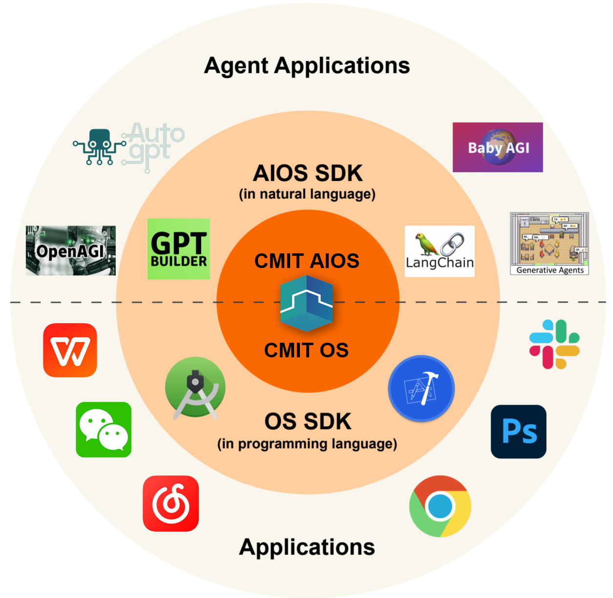

# CMIT AI OS Research Program

An AI OS is an operating system that utilizes large language models(LLM) to interact with users in natural language, providing intuitive and intelligent assistance. This list compiles resources to help understand, develop, and explore the possibilities of AI OS. The objective is to create a well-organized, community-driven repository of current, top-quality resources. This initiative aims to enhance practices within the AI OS and related domains. 

This is a curated list of awesome resources, tools, frameworks, papers, projects and discussions related to the concept of Large Language Model Operating Systems . Explore the future of human-computer interaction with natural language interfaces powered by advanced AI.

I highly recommend that you take the time to watch [Andrej Karpathy](https://github.com/karpathy)'s [presentation on LLM OS](https://youtu.be/zjkBMFhNj_g?feature=shared&t=2536).

## Table of Contents
- [Research Papers](#research-papers)
- [Articles and Blog Posts](#articles-and-blog-posts)
- [Videos and Talks](#videos-and-talks)
- [Projects and Implementations](#projects-and-implementations)
- [Communities and Discussions](#communities-and-discussions)
- [Development Tools and Frameworks](#development-tools-and-frameworks)
- [Performance and Optimization](#performance-and-optimization)
- [Security](#security)
- [Deployment](#deployment)
- [Business Implementation](#business-implementation)
- [Contributing](#contributing)
- [License](#license)

## Research Papers
- [AIOS: LLM Agent Operating System](https://arxiv.org/abs/2403.16971)
- [MemGPT: Towards LLMs as Operating Systems](https://arxiv.org/abs/2310.08560)

## Articles and Blog Posts
- [Andrej Karpathy --Sep 29, 2023](https://x.com/karpathy/status/1707437820045062561)
- [Andrej Karpathy --Nov 11, 2023](https://twitter.com/karpathy/status/1723140519554105733)

- [Illustrated LLM-OS](https://huggingface.co/blog/shivance/illustrated-llm-os)
- [Simulators --](https://www.lesswrong.com/posts/vJFdjigzmcXMhNTsx/simulators)
- [Goodbye Windows, Hello LLMs: The Future of Operating Systems](https://medium.com/@ronaldmannak/goodbye-windows-hello-llms-the-future-of-operating-systems-7ba61ea03e8d)
- [The Potential Revolutionary Value of LLMs as Operating Systems --Aug 16, 2024](https://medium.com/codex/the-potential-revolutionary-value-of-llms-as-operating-systems-74703ce46a5b)
- [Introducing llm OS: Unlocking the Power of Large Language Models as Operating Systems --Jun 13, 2024](https://medium.com/@honeyricky1m3/introducing-llm-os-unlocking-the-power-of-large-language-models-as-operating-systems-54274d0d8474)
- [计算机行业深度研究：全球大模型将往何处去？](https://finance.sina.com.cn/stock/stockzmt/2024-09-01/doc-incmscve4863669.shtml) 
预期#6：从普通操作系统到 LLM 操作系统  
LLM 操作系统是 Agent 在系统层面的具象化。LLM OS 是前 OpenAI 科学家 Andrej Karpathy 提出的设想，其中LLM 将替代 CPU 作为操作系统核心，LLM 的上下文窗口是 RAM，接受用户指令并输出控制指令，在 LLM 核心外部有存储、工具、网络等各种“外设” 供LLM 调用。我们认为，从结构上看，LLM OS 和图表 67 所示的 Agent 架构十分相似， 可以看做 Agent 在操作系统领域的具象化。LLM OS 的核心就是模型能力，随着 GPT-5 推 理性能的不断提升，我们认为 LLM 和 OS 结合的范式将更有可能实现，届时人类和 OS 的 交互方式将不再以键鼠操作为主，而会转向基于LLM 的自然语言或语音操作，进一步解放 人类双手，实现交互方式的升级。
- [LLMs are the new CPUs --March 15, 2023](https://every.to/divinations/llms-are-the-new-cpus?sid=26026)

## Videos and Talks
- [Intro to Large Language Models - Andrej Karpathy](https://www.youtube.com/watch?v=zjkBMFhNj_g)
- [Build the LLM OS Autonomous LLMs as the new Operating System - Phidata](https://www.youtube.com/watch?v=YMZm7LdGQp8)
- [Agent OS: LLM OS Micro Architecture for Composable, Reusable AI Agents - IndyDevDan](https://www.youtube.com/watch?v=8wSH4XukcH8)
- [OS-World: Improving LLM Agent Operating Systems!](https://www.youtube.com/watch?v=zm1_Huwb26I)
- [LLM OS with gpt-4o - Phidata](https://www.youtube.com/watch?v=6g2KLvwHZlU)
- [LLM OS on AWS - Ashpreet Bedi](https://x.com/ashpreetbedi/status/1797320918274068700)

## Projects and Implementations
- [MemGPT](https://github.com/cpacker/MemGPT)
- [AIOS](https://github.com/agiresearch/AIOS)
- [Phidata - Serving LLM OS on AWS](https://docs.phidata.com/templates/llm-os/run-local)

## Communities and Discussions
- [LLM Agent Operating System - Rutgers University 2024 - AIOS](https://www.reddit.com/r/LocalLLaMA/comments/1bod1jt/llm_agent_operating_system_rutgers_university/)

## Development Tools and Frameworks
- 

## Performance and Optimization
- 

## Security
- 

## Deployment
-

## Business Implementation
- [AIOS Foundation](http://aios.foundation/)

## Contributing
Contributions are more than welcome! 🌟
